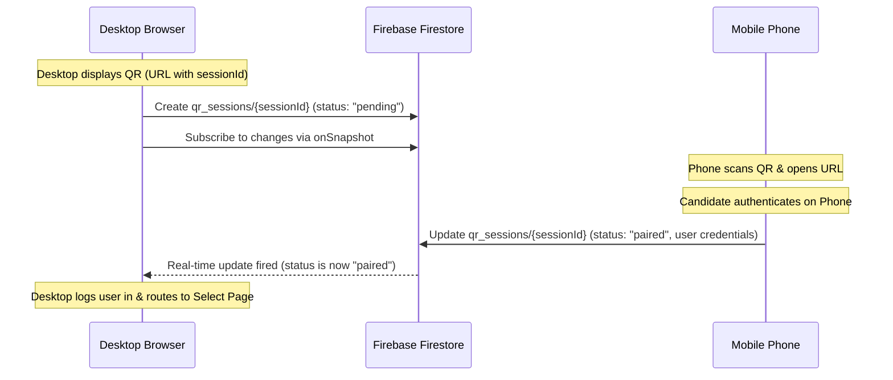

# Elevate — Technical Project Context & Architecture Documentation

This document serves as a complete technical guide and context file for **Elevate**, a secure AI-powered developer assessment and coding platform. Use this file as context for other AI models to instantly understand the system structure, design patterns, data flows, and build pipelines.

---

## 1. Directory & Folder Structure

Below is the absolute folder hierarchy of the project, mapping out exactly where components, business logic, models, utilities, and API wrappers reside.

```text
Elevate-SaaS/
├── api/
│   └── ssr.ts                   # Vercel Serverless Function (SSR entry adapter for TanStack Start)
├── public/                      # Static assets served from the server root
│   ├── badges/                  # Gold/Silver/Bronze SVG badges
│   └── elogo.png                # Corporate brand logo
├── src/
│   ├── business/                # BUSINESS LAYER
│   │   ├── services/
│   │   │   └── authService.ts   # QR Session ID generators and format validation
│   │   └── store/
│   │       ├── proctoringStore.ts# Zustand state for proctoring violations and warnings
│   │       └── sessionStore.ts   # Zustand state for active auth sessions, stats, history, and test answers
│   │
│   ├── data/                    # DATA LAYER (External API and Database Repositories)
│   │   ├── api/
│   │   │   └── openrouterClient.ts # OpenRouter wrapper for AI test generation/evaluation
│   │   └── repositories/
│   │       ├── assessmentRepository.ts # LLM Prompt configurations and evaluation schemas
│   │       ├── authRepository.ts       # Repository bridging Firebase Auth & QR sessions
│   │       ├── careerRepository.ts     # OpenRouter query for career mapping and guidance
│   │       ├── hintRepository.ts       # Code helper / Vibe coding AI hint responses
│   │       ├── questionFallbackRepository.ts # Hardcoded backup questions if LLM fails
│   │       └── testsRepository.ts      # Repository to persist finished exam results
│   │
│   ├── firebase/                # FIREBASE LAYER (Pure Firebase SDK Initialization & Queries)
│   │   ├── config.ts            # Firebase app initialization with Vite env keys
│   │   ├── auth.ts              # Firebase Auth operations (signIn, signOut, onAuthStateChanged)
│   │   ├── firestore.ts         # Firestore helper re-exports
│   │   ├── qr.ts                # Real-time Firestore sync & pairing on the 'qr_sessions' collection
│   │   ├── tests.ts             # Firestore read/writes on 'tests' collection
│   │   ├── users.ts             # Firestore read/writes on 'users' collection
│   │   └── index.ts             # Barrel export for the Firebase layer
│   │
│   ├── models/                  # MODELS LAYER (Strict TypeScript Typings, Schemas, and Interfaces)
│   │   ├── assessment.ts        # Types for AI Questions, Chat Messages, and Evaluations
│   │   ├── career.ts            # Typings for career recommendations
│   │   ├── proctoring.ts        # Interfaces for camera permission, violations, and detectors
│   │   └── session.ts           # Interfaces for zustand session states and statistics
│   │
│   ├── utilities/               # UTILITIES LAYER (Helper Functions, Constants, and Mathematical Rules)
│   │   ├── cn.ts                # Tailwind CSS class merging helper (clsx + tailwind-merge)
│   │   ├── constants.ts         # System constants (e.g. initial questions, prompts)
│   │   ├── parsing.ts           # JSON block parsers for LLM responses
│   │   └── scoring.ts           # Calculations mapping scores (0-100) to Gold/Silver/Bronze tiers
│   │
│   ├── components/              # PRESENTATION LAYER (Reusable Components)
│   │   ├── effects/             # Premium UI micro-animations
│   │   │   ├── Beams.tsx        # Dynamic animated background beams
│   │   │   ├── BorderBeam.tsx   # Premium border glow animation
│   │   │   ├── Sparkles.tsx     # Dynamic glowing sparkles canvas
│   │   │   └── Spotlight.tsx    # Cursor-following radial spotlight mask
│   │   ├── proctoring/          # Anti-cheat UI modules
│   │   │   ├── CameraPermissionGate.tsx # Renders webcam setup & check before starting test
│   │   │   ├── CameraPreview.tsx        # Floating webcam feed displaying active detector overlays
│   │   │   ├── ProctoringReport.tsx    # List of violations rendered inside Results page
│   │   │   ├── ViolationOverlay.tsx     # Full-screen red alert blocker when cheating is caught
│   │   │   └── WarningBadge.tsx         # Warning tally indicators (e.g., "1/3 Warnings")
│   │   ├── ui/                  # Clean Radix UI primitives styled with Tailwind CSS
│   │   ├── AppShell.tsx         # Application-wide navigation container, header, and layout
│   │   ├── CareerGuidanceModal.tsx # AI Career assistant modal popup
│   │   ├── MagneticButton.tsx   # Premium magnetic hover pull button effect
│   │   └── VibeAssistantPanel.tsx # Slide-out sidebar chat panel for code help
│   │
│   ├── hooks/                   # Custom React Hooks
│   │   ├── use-mobile.tsx       # Media queries checking mobile viewports
│   │   ├── useAIAssistant.ts    # Hooks for managing the dynamic code editor helper
│   │   ├── useProctoring.ts     # Wrapper managing all webcam tracking/anti-cheat detectors
│   │   ├── useQrLogin.ts        # 5s QR code rotation & Firestore real-time pairing listener
│   │   ├── useTestSession.ts    # AI question parsing and final exam submission handlers
│   │   ├── useVibeAssistant.ts  # Logic driving the vibe coding AI chat sidebar
│   │   └── useWebcamPermission.ts # Webcam media device access utility
│   │
│   ├── lib/                     # Backward-Compatibility Shim (Re-exports from refactored layers)
│   ├── routes/                  # TanStack Router File-Based Routing Pages
│   │   ├── __root.tsx           # Global routing layout wrapper and TanStack router settings
│   │   ├── index.tsx            # Landing/Home page
│   │   ├── login.tsx            # Login page (Manual sign-in + QR scanner view)
│   │   ├── dashboard.tsx        # Candidate dashboard showing stats, past test history, and Guidance trigger
│   │   ├── select.tsx           # Test configurator (Select language & Select Vibe/Pure mode)
│   │   ├── test.tsx             # Interactive assessment screen (Webcam stream, code editor, AI panel)
│   │   └── results.tsx          # Post-test report displaying score, badge tier, feedback, and cheating report
│   │
│   ├── router.tsx               # TanStack Router registry config
│   ├── server.ts                # Vinxi SSR handler
│   ├── start.ts                 # React Start middleware configuration
│   └── styles.css               # Core styling sheet
│
├── .env                         # Vite environment keys (Vercel deployment variables)
├── package.json                 # Project dependencies & scripts
├── tsconfig.json                # TypeScript configurations
├── vite.config.ts               # Vite configuration with tanstackStart plugin
└── vercel.json                  # Custom Vercel routing configuration for SSR and filesystem assets
```

---

## 2. Architectural Design Patterns

The codebase is organized into **5 Decoupled Layers** to maintain strict separation of concerns, visual elegance, testability, and framework neutrality:

```text
  [ Presentation Layer (UI/UX Pages & Components) ]
                          │
                          ▼
             [ Business Layer (Services & Stores) ]
                          │
                          ▼
           [ Data Layer (Repositories & API Clients) ]
                          │
                          ▼
          [ Firebase Layer (SDK Initialization/CRUD) ]
                          │
                          ▼
      [ Firebase Services (Auth, Firestore, Storage) ]
```

1. **Presentation Layer (UI/UX)**: Only handles view layout, CSS styles, UI states, and event captures. It _never_ directly talks to databases, Firebase, or external API endpoints. It accesses data exclusively by calling actions on Business Layer stores or hooks.
2. **Business Layer (Zustand Stores & Services)**: Drives state machine routing, logs candidates in, keeps score tracking, and coordinates workflows. It talks only to the Data Layer.
3. **Data Layer (Repositories)**: Translates business requirements into generic operations (e.g. `signIn`, `pairUser`, `saveTestResult`). It isolates external client integrations.
4. **Firebase Layer**: Hosts raw Firebase config and executes direct Firestore SDK actions (`setDoc`, `onSnapshot`, `signInWithEmailAndPassword`).
5. **Models Layer**: Defines centralized structural interfaces, strict types, and enums so the compiler enforces data safety across all layers.
6. **Utilities Layer**: Provides side-effect-free helpers like CSS merging (`cn`), scores-to-badge conversions, and JSON regex parsers.

---

## 3. Core Feature Workflows

### A. Real-Time QR Cross-Device Login Flow



1. **Session Initialization**:
   - The desktop browser mounts `login.tsx` (QR tab).
   - The `useQrLogin` hook generates a unique session ID (`elevate_login_<ts>_<random>`) and automatically creates a Firestore document: `qr_sessions/{sessionId}` with `status: "pending"`.
   - A background countdown timer updates a token value, recreating a fresh session document every 5 seconds.
2. **Real-time Listener**:
   - The desktop app subscribes to the document changes using a real-time Firestore `onSnapshot` listener.
3. **Scanning & Authorization**:
   - The desktop encodes the full pairing web link into the QR Code SVG: `${window.location.origin}/login?qr_session=${sessionId}`.
   - When a candidate scans this code with their phone camera, the phone opens this URL.
   - If the user is logged into their phone, they simply press **"Approve Sign-In"**. If not, they sign in on their phone, which automatically fires the authorization.
   - The phone calls `pairUser` which updates the Firestore session document to `status: "paired"`, adding the candidate's `email` and `displayName`.
4. **Auto Sign-in**:
   - The desktop's `onSnapshot` listener detects the status change, parses the candidate details, writes them to the `sessionStore` zustand state, and immediately redirects the user to `/select`.

---

### B. Strict Firebase Manual Authentication

- Under `/login` (Email tab), candidates can sign in manually using their email and password.
- This invokes `signIn(email, password)` which queries Firebase Auth.
- **Strict Constraint**: If the candidate account does not exist in Firebase, the system raises an error dialog. The application enforces pre-existing registration and does not perform silent auto-registration.

---

### C. AI Proctoring & Multi-Modal Anti-Cheat

The proctoring system initializes inside the `TestPage` before questions load:

1. **Camera Gate**: Candidates must approve webcam access.
2. **Object Detection (COCO-SSD)**: Runs inference frames on the webcam feed to detect:
   - **Multiple People**: Checks if more than one person is present in the frame.
   - **Cell Phones / Unallowed Objects**: Detects restricted electronic devices.
3. **Face Landmark Tracking (MediaPipe/TFJS)**:
   - Evaluates head pose angle. If the candidate turns away from the screen for an extended period, it flags a violation.
4. **OS Focus Observers**:
   - If the candidate switches tabs or minimizes the window, blur listeners catch the event immediately.
5. **Warning Tally**:
   - Each violation increments the warning tally on the floating `WarningBadge`.
   - Reaching 3 warnings terminates the assessment instantly, showing a `ViolationOverlay` and persisting the infraction details.

---

### D. Dynamic AI Test Generation

- Once the language and style (Vibe/Pure) are selected, `useTestSession` requests questions.
- It calls `generateTest()` which hits **OpenRouter** using custom system prompts matching the selected programming language.
- The AI returns 10 tailored code questions (multiple choice or code snippets).
- If the API fails or times out, the `questionFallbackRepository` automatically injects a collection of high-quality pre-configured backup questions.

---

### E. Career Guidance AI Modal

- Accessing the dashboard triggers an **AI Career Guidance** recommendation generator.
- It reads the candidate's historical scores, badges, and coding languages, formatting them into a structured payload for OpenRouter.
- The LLM evaluates strengths, identifies career paths, and recommends actionable next steps.

---

## 4. Vercel Deployment & SSR Configuration

Since TanStack Start uses a hybrid client/SSR execution framework, Vercel deployments are configured to support both static assets and edge/serverless dynamic functions.

### Vercel Routing Configuration (`vercel.json`)

The application routes assets and dynamic pages using Vercel's native filesystem router:

- `outputDirectory: "dist/client"`: Exposes client static builds (CSS, JS, SVGs) at the root level.
- `handle: "filesystem"`: Vercel's CDN instantly serves requested asset files (e.g. `/assets/styles.css`) directly from the filesystem.
- `src: "/(.*)" -> dest: "/api/ssr"`: Any request that isn't a static asset (e.g. `/select`, `/dashboard`) is rewritten to the `/api/ssr.ts` serverless function.

### SSR Serverless Adapter (`api/ssr.ts`)

This serverless function intercepts requests from Vercel's request/response cycle, translates them into standard Web Fetch `Request` objects, delegates them to TanStack Start's compiled server bundle (`dist/server/server.js`), and writes the rendered HTML/stream back to Vercel's response stream.

---

## 5. Maintenance & Future Modifications Policy

When adding features, modifications, or writing new routes:

1. **Never bypass layers**: Do not import Firebase or execute API calls directly inside a `.tsx` page file. Create types in `models/`, queries in `firebase/`, repositories in `data/`, and invoke them via Zustand stores in `business/`.
2. **Preserve backward compatibility**: `src/lib/` files act as shims so that existing routes do not break during layout/logic refactoring. Keep these shims clean.
3. **Respect route params**: The `/login` route uses an optional search parameter validation (`qr_session?: string`). When changing route paths or query schemas, make sure standard page-to-page redirects do not trigger TS compiler validation errors.
